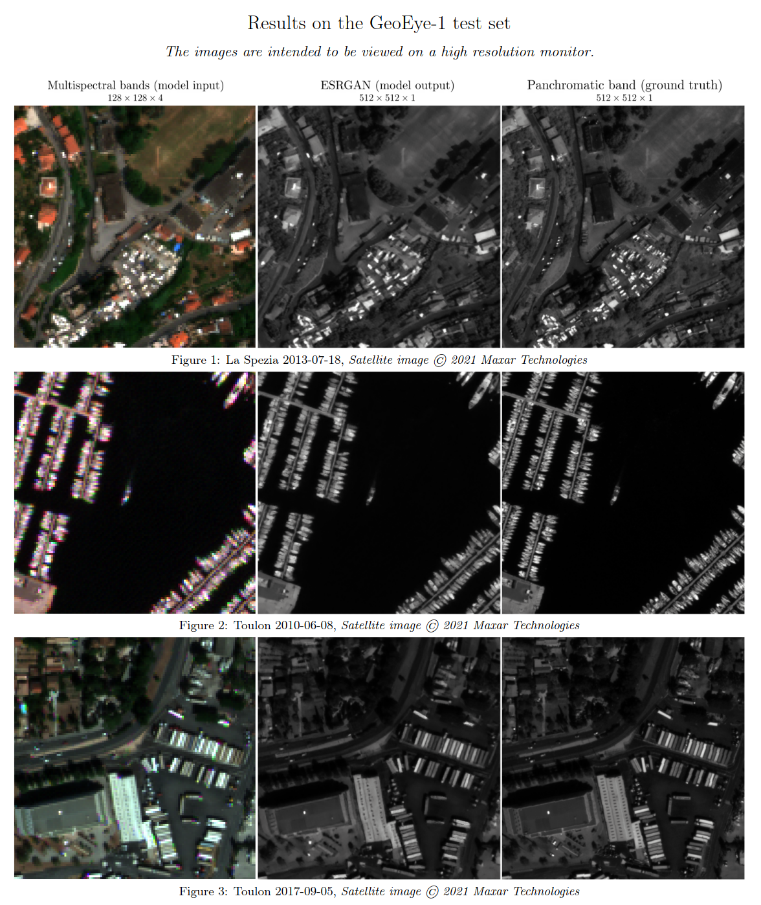

# multispectral-super-resolution
This repository is connected to my master's thesis, __Deep learning-based cross-sensor super resolution of
satellite images__, where I investigate how one of the highest performing GAN-based single-image super-resolution models, ESRGAN, can be adapted to a mutispectral satellite task.

## References
ESRGAN core component code based on https://github.com/peteryuX/esrgan-tf2
