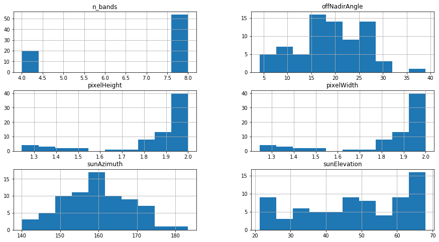

# Data exploration and descriptive statistics of satellite imagery

This jupyter notebook will parse, collate and analyze satellite imagery files from Maxar (former DigitalGlobe) The parsing of the metadata files (`DeliveryMetadata.xml`) are mainly general and should work for any Maxar product delivery. After parsing of the metadata files are converted to pandas dataframes the code is mainly project specific.

## Imports and setup


```python
# Path to location where individual satellite images are located
DATA_PATH = '/media/landet/Data/master/data/' 

# Name of metadata .xml file
METADATA_NAME = 'DeliveryMetadata.xml'

# Names of areas covered by satellite imagery
AREAS = ['La_Spezia', 'Toulon'] # Spelled like the directory names

# Speficy what the xmlns url on top of metadata .xml file is
# (should be second line)
XMLNS = 'http://xsd.digitalglobe.com/xsd/dm'

import numpy as np
import pandas as pd
import xml.etree.ElementTree as ET
import os
```

## Metadata parsing from xml to dictionary

Every satellite image delivery from Maxar contains a `DeliveryMetadata.xml` file with important specifications for both the multispectral and panchromatic images. The following functions finds all the `DeliveryMetadata.xml` files contained in all subdirectories of a directory and parses them into the *Pandas DataFrame* format which will be used for further descriptive statistics of the dataset.

### Functions
*TODO: Consider storing these in a .py file instead of in the notebook*


```python
def remove_xmlns(string, xmlns):
    """Removes a specified xmlns url from a string."""
    output = string.replace('{' + xmlns + '}', '')
    return output

def find(name, path):
    """Returns path of file if found in a directory."""
    for root, dirs, files in os.walk(path):
        if name in files:
            return os.path.join(root, name)

def is_panchromatic_product(xml_node):
    """Checks whether a satellite product is panchromatic."""
    for child in xml_node:
        if child.text == 'Pan':
            return True
    return False

def xml_root_children_to_dict(xml_root_element):
    """Iterates through children of xml root. Returns dictionary."""
    d = {}
    for child in xml_root_element:
        d[remove_xmlns(child.tag, XMLNS)] = child.text
    return d

def xml_product_to_dict(xml_product_element):
    """Parses the <product> element of metadata xml file into dictionary."""
    d = {}
    count_strip, count_product, count_band = 0, 0, 0
    for prod_child in xml_product_element:
        prod_child_tag = remove_xmlns(prod_child.tag, XMLNS)
        if prod_child_tag == 'strip':
            d[prod_child_tag+str(count_strip)] = xml_root_children_to_dict(prod_child)
            count_strip += 1
        elif prod_child_tag == 'productFile':
            d[prod_child_tag+str(count_product)] = xml_root_children_to_dict(prod_child)
            count_product += 1
        elif prod_child_tag == 'band':
            d[prod_child_tag+str(count_band)] = prod_child.text
            count_band += 1
        else:
            d[prod_child_tag] = prod_child.text
    d['n_bands'] = count_band
    d['n_products'] = count_product
    d['n_strips'] = count_strip
    return d

def xml_metadata_to_dict(path):
    """Parses a metadata xml file into two dictionaries, a panchromatic and a multispectral."""
    d_pan, d_ms, d_mutual = {}, {}, {}
    xml_parsed = ET.parse(path)
    for child in xml_parsed.getroot():
        child_tag = remove_xmlns(child.tag, XMLNS)
        if child_tag == 'product':
            if is_panchromatic_product(child):
                d_pan = xml_product_to_dict(child)
            else: 
                d_ms = xml_product_to_dict(child)
        else:
            d_mutual[child_tag] = child.text
    d_pan.update(d_mutual), d_ms.update(d_mutual)
    return d_pan, d_ms

def img_metadata_to_dict(metadata_name, data_path):
    """Parses all metadata xml files into a dictionary of dictionaries. Returns pan and ms dict."""
    img_metadata_pan, img_metadata_ms = {}, {}
    img_list = os.listdir(DATA_PATH)
    for img in img_list:
        path_to_metadata_files = find(METADATA_NAME, str(DATA_PATH + img))
        img_metadata_pan[img], img_metadata_ms[img] = xml_metadata_to_dict(path_to_metadata_files)
    return img_metadata_pan, img_metadata_ms

def add_names_to_metadata_dict(metadata_dictionary, list_of_area_names):
    """Adds area names to metadata dictionary"""
    for image_name in metadata_dictionary.keys():
        for area_name in list_of_area_names:
            if area_name in image_name:
                metadata_dictionary[image_name]['area_name'] = area_name
    return metadata_dictionary

def dict_to_df(img_metadata_dict):
    """Converts dictionary to Pandas DataFrame with correct data types."""
    img_metadata_df = pd.DataFrame(img_metadata_dict).transpose()
    img_metadata_df = img_metadata_df.astype(
        {'bitsPerPixel': 'category', 
         'cloudCover': 'float', 
         'datum': 'category', 
         'imageFileFormat': 'category',
         'imageTypeSize': 'category',
         'imagingTilingType': 'category',
         'isDynamicRangeAdjusted': 'bool', 
         'isMosaic': 'bool', 
         'mapProjection': 'category',
         'mapProjectionUnit': 'category',
         'mapProjectionZone': 'category', 
         'mergingAlgorithm': 'category',
         'mergedBand': 'category',
         'offNadirAngle': 'float',
         'pixelHeight': 'float',
         'pixelWidth': 'float',
         'processingLevel': 'category',
         'resamplingKernel': 'category',
         'sensorVehicle': 'category', 
         'sunAzimuth': 'float',
         'sunElevation': 'float', 
         'n_bands': 'int8', 
         'n_products': 'int8',
         'n_strips': 'int8'
    })
    
    # Converting the datatypes of the bands to category
    for i in range(20): #20 is just a number much higher than number of bands to be safe
        if str('band' + str(i)) in img_metadata_df.columns:
            img_metadata_df = img_metadata_df.astype({str('band'+str(i)): 'category'})
        
    img_metadata_df['earliestAcquisitionTime'] = pd.to_datetime(img_metadata_df['earliestAcquisitionTime'])
    img_metadata_df['latestAcquisitionTime'] = pd.to_datetime(img_metadata_df['latestAcquisitionTime'])
    img_metadata_df['productionDate'] = pd.to_datetime(img_metadata_df['productionDate'])
    img_metadata_df['updateDate'] = pd.to_datetime(img_metadata_df['updateDate'])

    return img_metadata_df
```

### The actual parsing to DataFrames


```python
img_metadata_pan, img_metadata_ms = img_metadata_to_dict(METADATA_NAME, DATA_PATH)

img_metadata_pan = add_names_to_metadata_dict(img_metadata_pan, AREAS)
img_metadata_ms = add_names_to_metadata_dict(img_metadata_ms, AREAS)

img_metadata_pan = dict_to_df(img_metadata_pan)
img_metadata_ms = dict_to_df(img_metadata_ms)
```

# Distribution of images

## Some quick sanity checks


```python
print('Number of panchromatic images:', len(img_metadata_pan))
print('Number of multispectral images:', len(img_metadata_ms))
print()
if list(img_metadata_pan.index.values) == list(img_metadata_ms.index.values):
    print('Pass: Identical keys. Keys in panchromatic and multispectral dictionaries are identical.')
else: print('Fail: Identical keys. Keys in panchromatic and multispectral dictionaries are not identical.')
print()
```

    Number of panchromatic images: 74
    Number of multispectral images: 74
    
    Pass: Identical keys. Keys in panchromatic and multispectral dictionaries are identical.
    


## Histograms multispectral


```python
hist_factors = ['pixelWidth', 
                'pixelHeight', 
                'n_bands',
                'offNadirAngle', 
                'sunAzimuth', 
                'sunElevation']
hist_ms = img_metadata_ms[hist_factors].hist(figsize=(15,8))
```





```python
hist_pan = img_metadata_pan[hist_factors].hist(figsize=(15,8))
```


## Contingency table Sensor x Area


```python
table = pd.crosstab(img_metadata_pan['area_name'], 
                    img_metadata_pan['sensorVehicle'])
table
```


<div>
<style scoped>
    .dataframe tbody tr th:only-of-type {
        vertical-align: middle;
    }

    .dataframe tbody tr th {
        vertical-align: top;
    }

    .dataframe thead th {
        text-align: right;
    }
</style>
<table border="1" class="dataframe">
  <thead>
    <tr style="text-align: right;">
      <th>sensorVehicle</th>
      <th>GE01</th>
      <th>WV02</th>
      <th>WV03_VNIR</th>
    </tr>
    <tr>
      <th>area_name</th>
      <th></th>
      <th></th>
      <th></th>
    </tr>
  </thead>
  <tbody>
    <tr>
      <td>La_Spezia</td>
      <td>11</td>
      <td>23</td>
      <td>2</td>
    </tr>
    <tr>
      <td>Toulon</td>
      <td>9</td>
      <td>20</td>
      <td>9</td>
    </tr>
  </tbody>
</table>
</div>


## Clouds?
*TODO: Get a measure of clod coverage in every specific image. Either automatically based on available algorithms or manually since the number of images are limited.*

## Calculate actual area covered by each image
*TODO: Many images do not cover the whole area of interest. By using the parsed metadata dataframe and shape geometry supplied with every image it is possible to calculate the actual area. This number may nuance distribution of images across areas, sensors and clouds.*


```python

```
